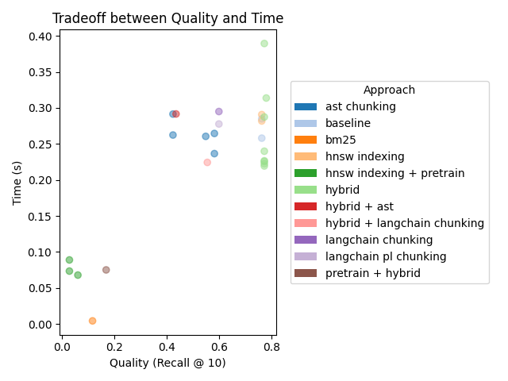

# Summary of Approaches

This document provides an overview of the approaches tried for solving the problem of efficient code search and question answering within a codebase using the Retrieval-Augmented Generation (RAG) system. Below, we summarize the key methods, their tradeoffs, and the results.

## Considered Approaches
### 1. Basic Retrieval-Augmented Generation (RAG) Approach
The initial RAG setup utilized a simple retrieval mechanism where relevant content from a code repository was retrieved and used to generate responses to user queries. The retrieval process was based on vector embeddings using Google's `text-embedding-004` embedding model to index the codebase and retrieve relevant portions based on the user’s query.
  
- **Advantages:**
  - **Simple to implement**: The baseline system was relatively straightforward, using embeddings and a basic retriever.
  - **Decent accuracy**: Worked well for many queries with obvious code matches.

### 2. CodeBERT for Embeddings
CodeBERT was used to generate embbeddings for both the code in the repository and the user’s query. The goal was to retrieve and rank the most relevant code snippets for a given query.
  
- **Advantages:**
  - **Pretrained for code**: CodeBERT is specifically designed for source code, which should theoretically give more precise results for code-related queries.
  - **Semantic Understanding**: Captured more semantic meaning from the code than previous models.
  
- **Disadvantages:**
  - **Performance drop when used with queries**: When integrating CodeBERT for query encoding, retrieval accuracy decreased, likely because the query embeddings weren't perfectly aligned with how the code was indexed.
  - **Embeddings mismatch**: A mismatch between how the embeddings for the code and query were generated seemed to affect retrieval quality.

### 3. AST Chunking Strategy
The **AST chunking** process, implemented in `ast_chunker.py`, involves breaking down code files into smaller, meaningful chunks using Tree-Sitter. This ensures that the retrieval system can focus on semantically relevant portions of the code.

- **Advantages:**
  **Semantic Preservation**: By chunking based on AST nodes, the system ensures that each chunk represents a meaningful unit of code, such as a function or class.
  **Language-Specific Parsing**: Tree-Sitter supports language-specific parsing, enabling precise chunking for different programming languages.

- **Disadvantages:**
  - **No Significant Accuracy Improvement**: The approach did not consistently improve retrieval accuracy, as the chunking process alone was insufficient for complex queries requiring deeper semantic understanding.
  - **Overhead in Parsing**: Parsing the codebase into ASTs and extracting terminal nodes added computational overhead without yielding significant benefits.

### 4. Query Expansion Using LLMs
Query expansion was implemented to refine user queries by leveraging a Language Model (LLM) to generate additional context-aware search terms.

- **Advantages:**
  - **Handles Ambiguity**: Query expansion helped in cases where user queries were vague or incomplete by generating more detailed and contextually relevant terms.
  - **Improved Recall for Specific Cases**: For certain queries, the expanded terms led to better matches in the retrieval process.

- **Disadvantages:**
  - **No Significant Accuracy Improvement**: Despite generating expanded queries, the overall retrieval accuracy did not improve consistently. The expanded terms often failed to align with the indexed code structure.
  - **Increased Latency**: The additional step of querying the LLM introduced significant latency, making the system slower and less eficient.
  - **Hard to Test**: It was challenging to evaluate this feature thoroughly due to the difficulty of finding an LLM API that allows a sufficient number of free calls for testing and evaluation purposes.

### 5. Hybrid Search with BM25 Retriever
The hybrid search approach combined BM25, a keyword-based retrieval method, with dense vector search to improve retrieval accuracy.

- **Advantages:**
  - **Simple to Implement**: The hybrid approach was straightforward to set up by combining the outputs of both retrievers.

- **Disadvantages:**
  - **No Significant Accuracy Improvement**: Despite combining two retrieval methods, the overall accuracy did not improve consistently. The results often favored one method over the other, leading to redundancy.

## Tradeoff plot
Based on the exploration of different approaches, we can visualize the performance tradeoffs between the various methods.

## Conclusion

Despite exploring several advanced methods, including AST-based chunking, query expansion with LLMs, and hybrid search, none of these approaches consistently improved retrieval quality. While each method showed potential in specific scenarios, the overall results did not meet expectations. It is not yet clear why these advanced techniques failed to enhance retrieval accuracy, but I suspect it could be due to misalignment between the methods and the underlying codebase structure or query requirements.
All of the approaches described above have been implemented in the codebase and can be easily activated by uncommenting respective lines of code (denoted with `NOTE` comments).

Possible future enhancements:
- Experiment more with custom BERT-based embedding models.
- Expanding support for additional indexing and retrieval algorithms.
- Enhancing graph-based retrieval in AST with GNN model.